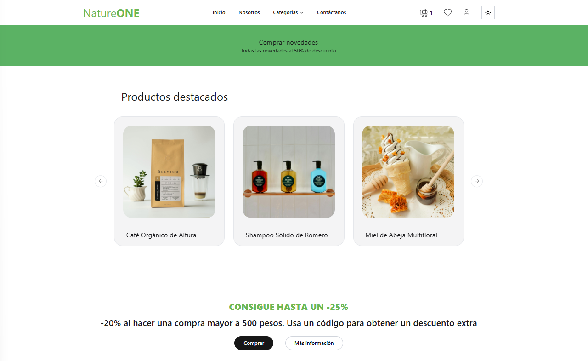
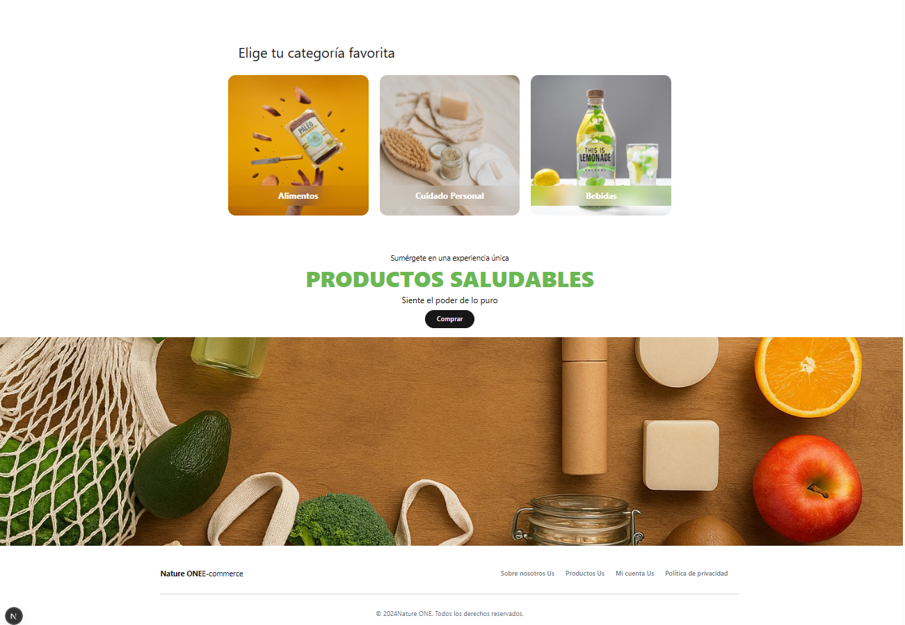

# 🌿 Nature-One - Tienda de Productos Naturales (Proyecto Demostrativo)

Nature-One es un proyecto frontend moderno de comercio electrónico (e-commerce) desarrollado como demostración práctica para exhibir el diseño e implementación de plataformas dinámicas, rápidas e interactivas. Con una temática enfocada en la venta de productos naturales y orgánicos, este sitio sirve de portafolio para demostrar flujos de usuario completos, desde la exploración de productos hasta el proceso de pago.



---

## 🚀 Tecnologías Utilizadas

Este proyecto fue construido utilizando herramientas de última generación en el ecosistema frontend:

- **[Next.js 15 (App Router)](https://nextjs.org/)**: Estructura de enrutamiento dinámico, renderizado híbrido y optimización de rendimiento.
- **[React 19](https://react.dev/)**: Última versión de la biblioteca de UI, aprovechando mejoras de renderizado.
- **[Tailwind CSS v4](https://tailwindcss.com/)**: Estilos rápidos configurados mediante PostCSS para una carga ultra veloz y utilidades de diseño modernas.
- **[Zustand](https://zustand.docs.pmnd.rs/)**: Gestor de estado global ligero y rápido, utilizado para manejar el carrito de compras y los productos favoritos.
- **[Stripe](https://stripe.com/)**: Integración oficial de pasarela de pagos para simular flujos de compra seguros.
- **[pnpm](https://pnpm.io/)**: Gestor de paquetes rápido e inteligente elegido para la instalación de dependencias y rendimiento de almacenamiento.

---

## 📁 Estructura del Proyecto

El proyecto sigue una estructura limpia organizada por carpetas funcionales:

```text
/
├── api/                   # Integración con servicios backend (productos, categorías y checkout)
├── app/                   # Enrutamiento basado en App Router de Next.js
│   ├── (routes)/          # Rutas principales del comercio electrónico
│   │   ├── cart/          # Página del carrito de compras
│   │   ├── category/      # Vistas de productos por categorías
│   │   ├── contactanos/   # Página de contacto
│   │   ├── cuenta/        # Perfil/Cuenta del usuario
│   │   ├── loved-products/# Sección de productos favoritos
│   │   ├── nosotros/      # Información acerca de la empresa/marca
│   │   ├── product/       # Detalle de producto específico
│   │   └── success/       # Confirmación de compra exitosa
│   ├── layout.tsx         # Layout principal con navegación global y footer
│   └── page.tsx           # Página de inicio (Banners, destacados y categorías)
├── components/            # Componentes interactivos de UI (carruceles, tarjetas de productos, etc.)
├── hooks/                 # Hooks de React personalizados
├── lib/                   # Funciones utilitarias (formateo de precios, clases dinámicas)
├── public/                # Recursos y assets estáticos
├── types/                 # Definición de tipos de TypeScript
├── components.json        # Configuración de componentes de UI
├── postcss.config.mjs     # Configuración de PostCSS para Tailwind CSS v4
├── tailwind.config.ts     # Configuración y extensión del tema de Tailwind
└── tsconfig.json          # Configuración de TypeScript
```

---

## ⚙️ Configuración del Entorno (.env.local)

El frontend requiere variables de entorno para conectarse con la API del backend de Strapi y comunicarse con la pasarela de pagos de Stripe.

1. Copia el archivo de plantilla `.env.example` para crear tu configuración local:
   ```bash
   cp .env.example .env.local
   ```
2. Modifica el archivo `.env.local` y establece los valores de conexión:
   * `NEXT_PUBLIC_BACKEND_URL`: URL de desarrollo del servidor backend (`http://localhost:1337`).
   * `NEXT_PUBLIC_STRIPE_PUBLISHABLE_KEY`: Tu clave pública de pruebas (`pk_test_...`) obtenida del dashboard de desarrollo en Stripe.

> [!IMPORTANT]
> Nunca comitas el archivo `.env.local` o cualquier archivo `.env` al repositorio de Git. Este archivo ya se encuentra bloqueado en tu `.gitignore`.

---

## 🛠️ Comandos de Desarrollo

Para este proyecto se utiliza **`pnpm`** como gestor de paquetes exclusivo. Asegúrate de tenerlo instalado de forma global.

### 1. Instalar dependencias
Para recrear el archivo de bloqueo y descargar todos los paquetes:
```bash
pnpm install
```

### 2. Iniciar servidor de desarrollo
Inicia el servidor local con soporte HMR:
```bash
pnpm dev
```
La aplicación estará disponible en: `http://localhost:3000`

### 3. Compilar para producción
Genera una compilación optimizada lista para producción:
```bash
pnpm build
```
Los archivos optimizados se guardarán en la carpeta `.next/`.

### 4. Iniciar servidor de producción
Inicia el servidor local utilizando la compilación optimizada previa:
```bash
pnpm start
```

### 5. Linter y análisis estático
Ejecuta las reglas de ESLint para garantizar la calidad del código:
```bash
pnpm lint
```

---

## 🎨 Características Destacadas
- **Gestión de Carrito y Favoritos**: Estado persistente del lado del cliente gracias a Zustand.
- **Diseño Adaptable (Responsive)**: Totalmente optimizado para una excelente visualización tanto en móviles como en monitores de escritorio.
- **Simulación de Pago Segura**: Integración de Stripe Elements para flujos de transacciones realistas.

---

## 📸 Capturas de Pantalla

A continuación se muestran las secciones clave diseñadas para este e-commerce:

### 🛍️ Catálogo y Categorías

